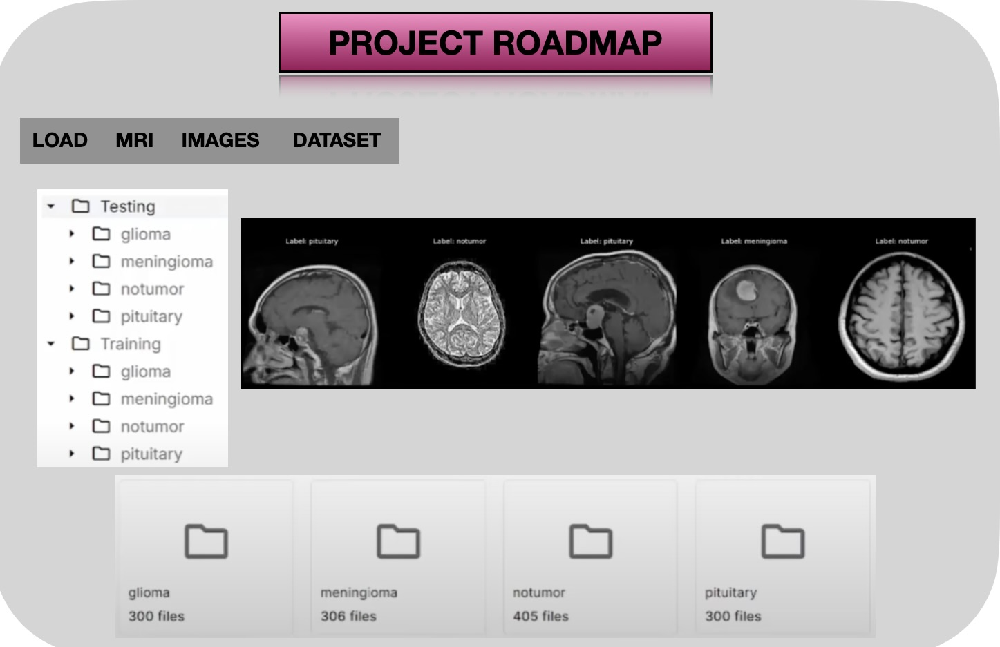
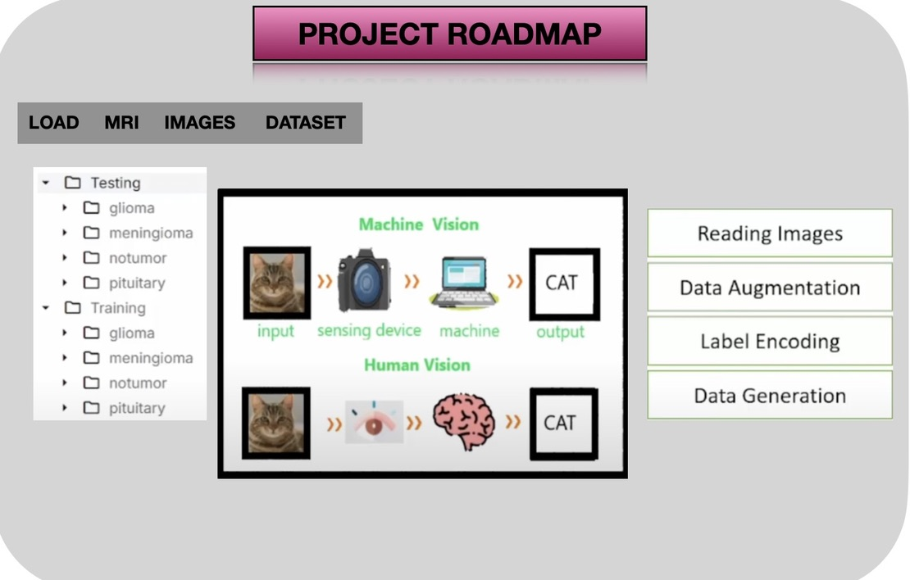
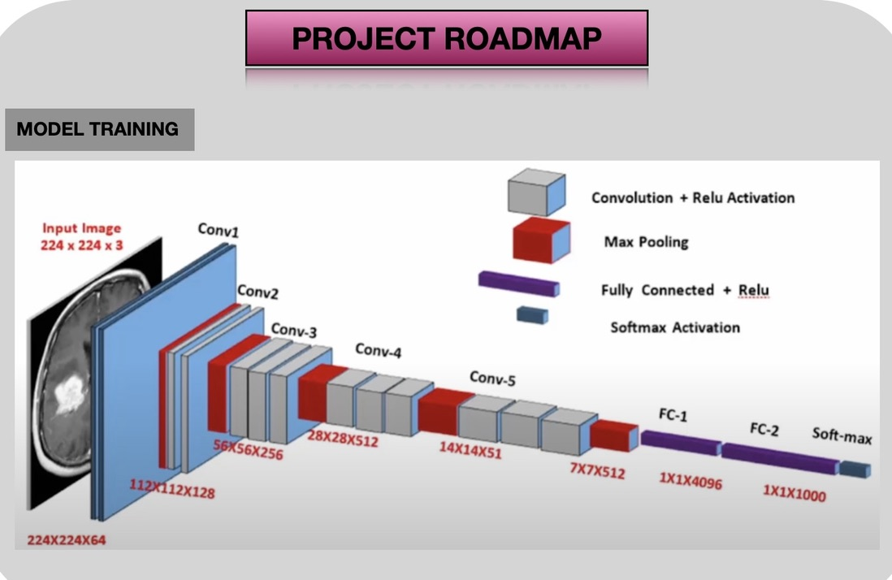

# Brain Tumor Detection Using Deep Learning

## Overview
This project utilizes deep learning techniques to detect tumors from medical images. Using convolutional neural networks (CNNs), the model is trained to classify images and assist in early tumor detection, aiding medical professionals in diagnosis.

## Project Roadmap  

Below is the project roadmap represented in three stages:

### 1. 
  

### 2.  
 

### 3.  
  

## Features
- Image classification for tumor detection
- Deep learning model using CNNs
- Dataset preprocessing and augmentation
- Performance evaluation with metrics like accuracy, precision, and recall
- Visualization of model predictions

## Technologies Used
- Python
- TensorFlow/Keras
- OpenCV
- NumPy
- Matplotlib
- Jupyter Notebook

## Dataset  
The dataset consists of medical images labeled as either tumor or non-tumor. Proper preprocessing and augmentation techniques have been applied to improve model performance.  

**Dataset Link:** [Your Dataset Link Here](https://your-dataset-link.com](https://www.kaggle.com/datasets/masoudnickparvar/brain-tumor-mri-dataset)  


## Installation
1. Clone the repository:
   ```bash
   git clone https://github.com/your-username/tumor-detection.git
   cd tumor-detection
2. Install dependencies:
   ```bash
   pip install -r requirements.txt
3. Run the Jupyter Notebook
   ```bash
   jupyter notebook

## Usage
- Load the dataset and preprocess images
- Train the CNN model on the dataset
- Evaluate model performance
- Predict tumor presence on new images

## Result
- The model achieves high accuracy in detecting tumors.
- Performance metrics and visualizations are included in the notebook.


  
   
